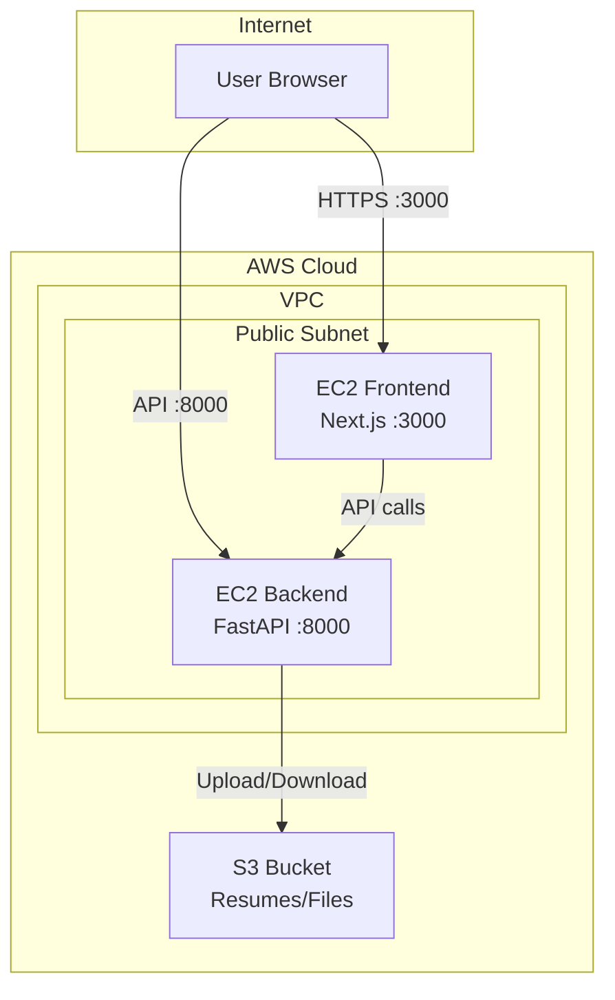

# AWS Infrastructure Setup Plan

## Overview

Set up AWS S3 for file uploads and deploy backend/frontend on separate EC2 instances using Docker, with proper security groups and IAM configuration.

## Todos

- [ ] Add boto3 to backend/requirements.txt
- [ ] Update storage_service.py with real S3 upload/download using boto3
- [ ] Add AWS_REGION to config.py
- [ ] Update frontend Dockerfile to accept NEXT_PUBLIC_API_BASE as build arg
- [ ] Walk through AWS Console to create S3 bucket, IAM role, security groups, and EC2 instances

---

## Architecture Overview



## 1. S3 Bucket Setup

Create a bucket for resume and file storage:

**AWS Console Steps:**

- Go to S3 > Create bucket
- Bucket name: `jb-finder-uploads-{your-account-id}` (must be globally unique)
- Region: Choose your preferred region (e.g., `us-east-1`)
- Block all public access: **Enabled** (files accessed via signed URLs)
- Versioning: Optional (disabled for MVP)

**Bucket Policy:** None needed (IAM role handles access)

**CORS Configuration (for direct browser uploads if needed later):**

```json
[
  {
    "AllowedHeaders": ["*"],
    "AllowedMethods": ["PUT", "POST", "GET"],
    "AllowedOrigins": ["*"],
    "ExposeHeaders": ["ETag"]
  }
]
```

## 2. IAM Role for EC2

Create an IAM role for the backend EC2 to access S3:

**Role name:** `jb-finder-backend-role`

**Trust policy:** EC2 service

**Attached policy (inline):**

```json
{
  "Version": "2012-10-17",
  "Statement": [
    {
      "Effect": "Allow",
      "Action": [
        "s3:PutObject",
        "s3:GetObject",
        "s3:DeleteObject",
        "s3:ListBucket"
      ],
      "Resource": [
        "arn:aws:s3:::jb-finder-uploads-*",
        "arn:aws:s3:::jb-finder-uploads-*/*"
      ]
    }
  ]
}
```

## 3. Security Groups

**Backend Security Group (`jb-finder-backend-sg`):**

| Type | Port | Source |
|------|------|--------|
| SSH | 22 | Your IP |
| Custom TCP | 8000 | 0.0.0.0/0 (API access) |

**Frontend Security Group (`jb-finder-frontend-sg`):**

| Type | Port | Source |
|------|------|--------|
| SSH | 22 | Your IP |
| Custom TCP | 3000 | 0.0.0.0/0 (Web access) |

**Note:** These are **inbound rules**. Outbound rules default to allow all (needed for package downloads, API calls, S3 access).

## 4. EC2 Instances

**Backend Instance:**

- AMI: Amazon Linux 2023 or Ubuntu 22.04
- Instance type: `t3.small` (2 vCPU, 2 GB RAM)
- IAM role: `jb-finder-backend-role`
- Security group: `jb-finder-backend-sg`
- Storage: 20 GB gp3

**Frontend Instance:**

- AMI: Amazon Linux 2023 or Ubuntu 22.04
- Instance type: `t3.micro` (1 vCPU, 1 GB RAM)
- Security group: `jb-finder-frontend-sg`
- Storage: 10 GB gp3

## 5. Code Changes Required

### Update S3 Storage Service

File: `backend/app/services/storage_service.py`

Replace local file storage with real S3 uploads using `boto3`. The service will:

- Upload files to S3 with a unique key
- Return the S3 key for storage in the database
- Support downloading via presigned URLs

### Update Config

File: `backend/app/config.py`

Add:

- `AWS_REGION` environment variable
- S3 bucket name from `S3_BUCKET` (already exists)

### Update Requirements

File: `backend/requirements.txt`

Add `boto3` for AWS SDK.

### Update Frontend API Base

File: `frontend/app/page.tsx`

The `NEXT_PUBLIC_API_BASE` will point to the backend EC2 public IP.

## 6. Deployment Steps

### Backend EC2 Setup

```bash
# SSH into backend EC2
ssh -i your-key.pem ec2-user@<backend-ip>

# Install Docker
sudo yum update -y
sudo yum install -y docker git
sudo systemctl start docker
sudo systemctl enable docker
sudo usermod -aG docker ec2-user

# Clone repo and deploy
git clone <your-repo-url> jb-finder-app
cd jb-finder-app/backend

# Create .env file
cat > .env << EOF
DATABASE_URL=sqlite:////app/dev.db
S3_BUCKET=jb-finder-uploads-xxxxx
AWS_REGION=us-east-1
OPENAI_API_KEY=sk-xxxxx
OPENAI_MODEL=gpt-4
EOF

# Build and run
docker build -t jb-finder-backend .
docker run -d -p 8000:8000 --env-file .env -v $(pwd)/dev.db:/app/dev.db jb-finder-backend
```

### Frontend EC2 Setup

```bash
# SSH into frontend EC2
ssh -i your-key.pem ec2-user@<frontend-ip>

# Install Docker
sudo yum update -y
sudo yum install -y docker git
sudo systemctl start docker
sudo systemctl enable docker
sudo usermod -aG docker ec2-user

# Clone repo and deploy
git clone <your-repo-url> jb-finder-app
cd jb-finder-app/frontend

# Build with backend URL
docker build -t jb-finder-frontend \
  --build-arg NEXT_PUBLIC_API_BASE=http://<backend-ip>:8000 .

docker run -d -p 3000:3000 jb-finder-frontend
```

## 7. Environment Variables Summary

| Variable | Where | Value |
|----------|-------|-------|
| `S3_BUCKET` | Backend | Your S3 bucket name |
| `AWS_REGION` | Backend | e.g., `us-east-1` |
| `OPENAI_API_KEY` | Backend | Your OpenAI key |
| `DATABASE_URL` | Backend | `sqlite:////app/dev.db` |
| `NEXT_PUBLIC_API_BASE` | Frontend (build-time) | `http://<backend-ip>:8000` |

## 8. Verification Checklist

- [ ] S3 bucket created with correct permissions
- [ ] IAM role attached to backend EC2
- [ ] Security groups allow correct ports
- [ ] Backend running on port 8000
- [ ] Frontend running on port 3000
- [ ] Resume upload stores file in S3
- [ ] Frontend can reach backend API
