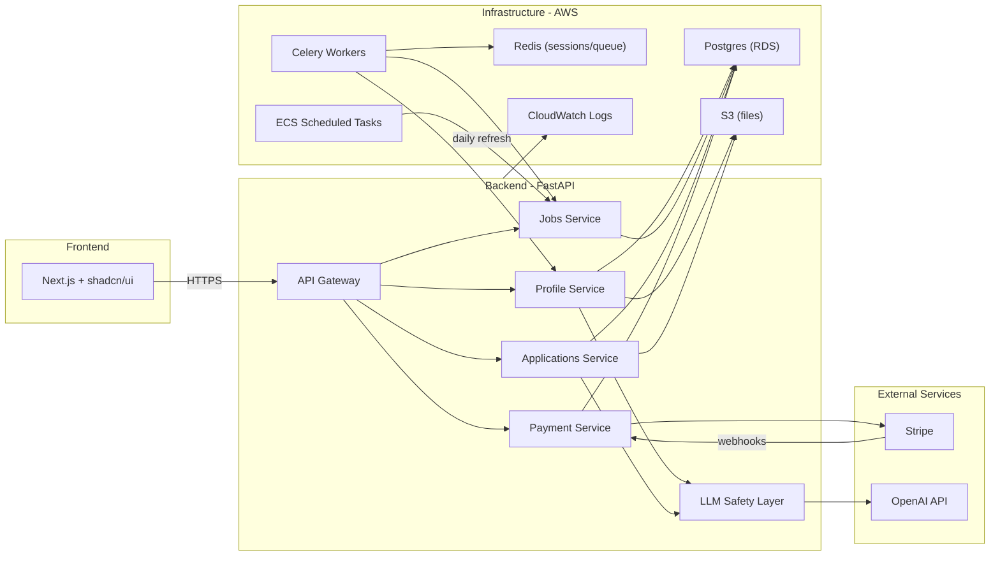
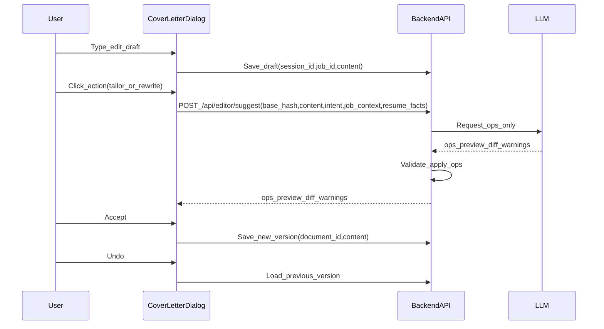

# Job Finder MVP Architecture Plan

## Goals

- Translate the PRD into a concrete architecture and implementation approach.
- Define minimal data model, APIs, and services needed for the MVP flow.
- Keep scope aligned with constraints: no auto-apply, no scraping, no mandatory signup.

## Context from Auto-Apply Systems (Deferred)

- Full auto-apply pipelines typically include ingestion from scraped job boards, embeddings-based matching, per-job document generation, and browser automation (Playwright/Puppeteer) with tracking feedback loops.
- These capabilities are explicitly deferred in the MVP due to constraints: no scraping, no browser automation, and no auto-submit.
- We will structure interfaces so future automation can be added later without reworking MVP data models.

## Assumptions

- Repository is active with backend/frontend + docker-compose in place.
- Styling will use Tailwind CSS per user rule.

## User Types

### MVP
- **Job Seekers (type: U)**: Upload resume, view matches, complete assisted applications. Default type.

### Post-MVP
- **Recruiters (type: R)**: Search for candidates, view profiles (later: post jobs).
- **Employers (type: E)**: Company accounts, post jobs, manage applications (later).

Data model should include a `user_type` field from the start to support future expansion.

## Monetization (MVP) — Token-Based "Finder Credits"

### Core Concept

Instead of exposing raw LLM tokens (confusing to users), sell **"Finder Credits"**:
- **1 Credit ≈ 1,000 LLM tokens** (~750 words)
- Users buy a monthly allowance or top-up packs
- Show users the "credit cost" before they run expensive actions (Deep Analysis, Resume Tailoring)

### Subscription Tiers

| Plan | Target | Price | Allowance | Key Features |
|------|--------|-------|-----------|--------------|
| **Job Seeker** (Basic) | Casual hunters (<5 roles/week) | $9.99/mo | 500 Credits (500k tokens) | Resume Parsing (free), Match Analysis (~5 cr/job), Deep Analysis (~15 cr/job), Basic Resume Tailoring (~20 cr/job) |
| **Power Applier** (Pro) | Active seekers, many roles | $24.99/mo | 2,500 Credits (2.5M tokens) | Everything in Basic + Priority Processing, Advanced Resume Tailoring, Cover Letter Generator (~30 cr/doc) |
| **On-Demand** (Pay-as-you-go) | One-time need | $5 one-time | 200 Credits | For users who need one deep analysis + tailored resume immediately |

### Feature Credit Costs

| Feature | Estimated Credits |
|---------|-------------------|
| Resume Parsing | Free (low cost) |
| Match Analysis (Grade A-D) | ~5 credits/job |
| Deep Analysis (Learning Resources) | ~15 credits/job |
| Basic Resume Tailoring | ~20 credits/job |
| Cover Letter Generation | ~30 credits/doc |

### Payment Provider
- **Stripe** for subscriptions and one-time payments
- Stripe Checkout for payment flow (hosted, PCI-compliant)
- Webhooks for subscription lifecycle (created, renewed, cancelled)

### Implementation Strategy (Backend)

**Database updates:**
- Add `credit_balance` column to `SessionRecord`
- Rename `count` to `tokens_used` in `AnalysisUsage`

**Usage service updates:**
- Deduct tokens/credits instead of incrementing a counter
- Use `total_tokens` from `_log_usage` in `llm_service.py` for exact deduction

### Implementation Strategy (Frontend)

- **Credit Balance Display:** Show "Credits: 1,250" in header
- **Cost Estimates:** "Analyze this job? (Est. ~50 credits)", "Deep Analysis (Est. ~150 credits)"
- **Out of Credits:** Trigger Stripe Checkout modal when balance is too low for an action

### LLM Cost Control (Margins)

- **GPT-5.2** ($1.75/$14 per 1M tokens) is expensive
- **Optimization:** Use GPT-5-Standard ($1.25/$10) or cheaper reasoning model for "Match Analysis" (Grade A-D)
- Reserve expensive GPT-5.2 only for "Deep Analysis" and "Resume Tailoring" where quality is critical
- **Caching:** Deep analysis and resume reviews are cached by `job_id` + `session_id` so users don't pay twice for the same result

### Why This Model Works

- **Fairness:** Users pay for what they use. Heavy users cover their own API costs.
- **Scalability:** Lock in a margin (e.g., 50% markup on token costs) regardless of how heavy the usage is.
- **Flexibility:** Add new expensive features (e.g., "Mock Interview Chat") without changing plan prices—just set a higher credit cost for that feature.

## Tech Stack (Finalized)

### Frontend
- **Next.js** (App Router)
- **shadcn/ui** component library
- **Tailwind CSS** for styling
- **Context API** for state (plan to migrate to Zustand if state grows)
- **Zod** for runtime validation

### Backend
- **Python + FastAPI**
- **OpenAI GPT-5** (abstracted for future multi-model support)
- **LLM safety layer**: prompt templates + Pydantic output validation + resume-truth checks (no hallucinated skills)
- **Pydantic** for request/response schemas

### Payments
- **Stripe** (subscriptions + one-time payments)
- Stripe Checkout (hosted payment page)
- Stripe Webhooks (subscription events)

### Database
- **Postgres + JSONB** (no MongoDB; JSONB handles semi-structured data)

### Storage
- **AWS S3** for all files (resumes, cover letters, generated docs)

### Queue / Workers
- **Celery + Redis** for async tasks (parsing, ingestion, doc generation)

### Scheduler
- **AWS ECS scheduled tasks** for daily job ingestion refresh

### Observability
- **stdout/stderr structured logs + AWS CloudWatch** (keep simple for MVP)

### CI/CD
- **GitHub Actions** (skip Jenkins)

### Infrastructure
- **Docker** containers
- **AWS** (ECS, RDS, S3, CloudWatch)
- **Redis** (sessions, rate limiting, Celery broker)

### Rate Limiting
- FastAPI middleware + Redis

### Auth (Post-MVP)
- Plan for JWT or NextAuth when account conversion is added

## Proposed Architecture (High-Level)

- Frontend (Next.js): landing, resume upload, match list, job selection, assisted apply, and post-action signup prompt.
- Backend API gateway: handles upload, session profile, matching, and apply preparation.
- Services:
  - Resume parsing service (PDF/DOCX extraction + normalization).
- Job ingestion service (Greenhouse polling + de-dup + daily refresh).
  - Matching service (deterministic scoring + explainable reasons).
  - Assisted apply service (cover letter generation + download/copy payloads).
  - Payment service (Stripe integration, subscription management).
- Data stores:
  - Postgres + JSONB for jobs, companies, applications, sessions, and accounts.
  - Redis for session caching, rate limiting, and Celery task broker.
  - S3 for all file storage (resumes, cover letters, generated docs).

## Job Discovery (MVP)

### The Challenge
Greenhouse APIs require knowing company board tokens upfront — no global search.

### Solution: Hybrid Approach
1. **Curated seed list** (~50 companies): Pre-selected tech companies known to be hiring. Polled daily.
2. **User-specified companies** (optional): Users can add target companies they're interested in.
3. **Community expansion**: Grow the list over time based on user submissions.

### Implementation
- Seed list stored in `companies` table with board tokens.
- Users can suggest companies via simple form (stored for review).
- Industry-based suggestions possible later (e.g., "fintech" → Stripe, Plaid).

## Job Ingestion (MVP)

### ATS Sources
Only **Greenhouse** public API (no auth required) for MVP:

| ATS | Endpoint Pattern | Notes |
|-----|------------------|-------|
| Greenhouse | `boards-api.greenhouse.io/v1/boards/{token}/jobs` | Most widely used |

### Implementation
- Shared `ATSAdapter` interface with Greenhouse implementation.
- Curated seed list: ~25 companies to start (validated).
- Daily refresh via ECS scheduled task.
- Deduplication on `source` + `source_job_id`.

### Data Extracted
- Job ID, title, location, department, description (HTML)
- Apply URL (for manual submission)
- Pay ranges from Greenhouse pay transparency endpoint
- Seniority inferred from title

## Architecture Diagram (MVP)



## Data Model Outline

### Sessions (TTL: 24 hours)
- `id`: UUID
- `resume_text`: extracted text
- `resume_s3_key`: S3 path to original file
- `extracted_skills`: JSONB array
- `inferred_titles`: JSONB array
- `seniority`: string (junior/mid/senior/lead/executive)
- `location_pref`: string (optional filter)
- `remote_pref`: boolean (optional filter)
- `years_experience`: integer
- `daily_selections`: integer (reset daily, max 5 for free)
- `created_at`: timestamp
- `expires_at`: timestamp (created_at + 24h)
- `first_name`, `last_name`, `email`, `phone`, `location`, `social_links`

### Jobs
- `id`: UUID
- `company_id`: FK
- `title`: string
- `location`: string
- `remote`: boolean
- `seniority`: string
- `description`: text
- `pay_ranges`: JSONB array
- `source`: enum (greenhouse)
- `source_job_id`: string
- `apply_url`: string
- `updated_at`: timestamp

### Companies
- `id`: UUID
- `name`: string
- `greenhouse_board_token`: string (nullable)
- `website`: string (nullable)
- `user_suggested`: boolean (default: false)

### Matches (computed, cacheable)
- `session_id`: FK
- `job_id`: FK
- `score`: integer (0-100)
- `tier`: enum (strong, medium, weak)
- `reasons`: JSONB (why it matches)
- `missing_skills`: JSONB array

### Applications
- `id`: UUID
- `session_id`: FK (nullable after conversion)
- `user_id`: FK (nullable before conversion)
- `job_id`: FK
- `cover_letter_s3_key`: string (nullable for free tier)
- `cover_letter_tone`: enum (formal, concise, technical)
- `resume_variant_s3_key`: string (nullable, v1.1)
- `status`: enum (prepared, user_submitted)
- `created_at`: timestamp

### Users
- `id`: UUID
- `email`: string
- `user_type`: enum (U, R, E) — default: U (job seeker)
- `plan`: enum (free, pro) — default: free
- `stripe_customer_id`: string (nullable)
- `subscription_status`: enum (none, active, cancelled, past_due)
- `subscription_ends_at`: timestamp (nullable)
- `created_at`: timestamp

### Subscriptions (Stripe sync)
- `id`: UUID
- `user_id`: FK
- `stripe_subscription_id`: string
- `plan_type`: enum (monthly, one_time)
- `status`: enum (active, cancelled, past_due)
- `current_period_start`: timestamp
- `current_period_end`: timestamp
- `created_at`: timestamp

## API Surface (Current)

### Core Flow
- `POST /api/resume/upload` → returns session_id + parsed profile
- `GET /api/matches?session_id=...` → ranked jobs (initial load)
- `POST /api/matches` → ranked jobs with filters + LLM query (reload)
- `POST /api/jobs/select` → store selections (enforces 5/day limit for free)
- `POST /api/apply/prepare` → cover letter (Pro only) + download/copy payloads
- `POST /api/signup` → convert session to user

### Payments
- `POST /api/checkout/create` → returns Stripe Checkout session URL
- `POST /api/webhooks/stripe` → handle Stripe events (subscription created, cancelled, etc.)
- `GET /api/subscription/status` → returns current plan + limits
- `GET /api/jobs/selected` → list selected jobs for session

## Cover Letter Editor (AI-Assisted)

### Goal
Allow users to create, update, and delete cover letter content using AI with full user control via diffs, accept/reject, undo, and version history.

### Core UX
- Single document-first editor (plain text or markdown)
- AI never edits directly → it returns proposed changes
- User sees diff preview and chooses: Accept, Reject, Undo (via versions)

### Actions
- Generate from scratch (if empty; LLM must be grounded in resume facts + job context)
- Tailor to job
- Rewrite selection
- Shorten / expand
- Change tone
- Remove fluff

### Frontend
- Editor: Lexical (plain text editor surface with history + persistence)
- Diff viewer (word/line-level)
- Version list (timestamp, jobId)
- Inline selection support (optional v1)
- Draft persistence in DB, keyed by `session_id` + `job_id`

### Backend (FastAPI)
`POST /api/editor/suggest`

**Input**
```
{
  document_id,
  base_version_id,
  content,
  selection?,     // start/end indexes
  intent,         // e.g. "tailor", "shorten", "rewrite"
  constraints,    // tone, length
  job_context,
  resume_facts
}
```

**Output (STRICT)**
```
{
  base_hash,
  ops: [
    { type: "replace" | "insert" | "delete", start?, end?, pos?, text? }
  ],
  preview,
  diff,
  explanation,
  warnings
}
```

### Critical Design Rule
LLM outputs PATCHES, not raw text. Server applies edits, validates them, and stores accepted edits as new versions.

### Data Model
- `documents`: id, session_id, type, current_version_id
- `document_versions`: id, document_id, content, created_at, created_by, job_id
- Undo = load previous version

### AI Guardrails (Required)
- Only use facts from:
  - Resume facts
  - Job description
- No invented company metrics or achievements
- Enforce:
  - JSON schema validation
  - Edit bounds checks
  - Base version hash match
  - Max length (e.g., 250–400 words)
- If info is missing → write generic or flag warning

### MVP Scope (Build Order)
- Lexical editor + paste/edit
- /suggest API returning diff
- Tailor / rewrite / shorten actions
- Accept/reject changes
- Version history + undo

### v1 Enhancements
- Inline selection edits
- Section templates (opening, closing)
- Hallucination warnings
- Export (PDF later)

### Non-Goals (Now)
- Rich text formatting
- Autonomous agent editing
- External web/company research

### End-to-End Flow


## Matching Heuristics (Current + Planned)

### Current (Implemented)
- LLM builds search query from inferred titles + filters
- Filters: title terms, location, work mode (remote/hybrid/in-office), pay range
- Seniority filter excludes ±2+ levels
- Score is currently a placeholder (skills extraction removed)

### Tier Thresholds
- **Strong**: score >= 90
- **Medium**: score >= 60
- **Weak**: score < 60

### Planned
- Add deterministic scoring once job skill extraction returns

## Assisted Apply UX Flow

### Free Tier
- Select up to 5 jobs/day
- View match reasons
- Open apply link (no cover letter)

### Pro Tier
- Unlimited job selections
- For each selected job, user picks **cover letter tone**: formal / concise / technical
- Generate tailored cover letter via LLM (resume-truth enforced)
- Provide:
  - Copy-to-clipboard
  - Download as PDF/DOCX
  - Open employer application page (user manually submits)

## Compliance & Trust

- Always surface "We assist — you submit" messaging.
- No credential storage; only session-based info until signup.
- Explicit consent action per apply.

## Risks & Quality Gates (MVP-appropriate)

- Irrelevant matches → keep filters strict and make reasons visible.
- Hallucinated skills → enforce resume-truth checks during generation.
- Duplicate applications → dedupe on job source IDs and company+title+location.
- User control → allow opt-in selection only (no background apply).
- Payment fraud → use Stripe's built-in fraud protection.

## Repo Structure (Current)

```
jb-finder-app/
├── frontend/                # Next.js + shadcn/ui + Tailwind
│   ├── app/
│   ├── components/
│   ├── lib/
│   └── package.json
├── backend/                 # Python + FastAPI
│   ├── app/
│   │   ├── api/             # Route handlers
│   │   ├── services/        # Business logic (profile, jobs, applications, payments)
│   │   ├── schedulers/      # ATS ingestion + seed loaders
│   │   ├── services/llm     # LLM safety layer + prompt templates
│   │   ├── workers/         # Celery tasks (planned)
│   │   └── models/          # Pydantic schemas + DB models
│   ├── requirements.txt
│   └── Dockerfile
├── infra/                   # AWS CDK or Terraform (later)
├── docker-compose.yml       # Local dev (Postgres, Redis, etc.)
└── .github/workflows/       # GitHub Actions CI/CD
```

## Next Steps (Planned)

- Persist locked `title_terms` on session to survive reloads without re-query.
- Add Alembic migrations so DB changes don't require deleting SQLite.
- Reintroduce job skill extraction + deterministic scoring.
- Expand filters UI (clear/reset, chips, saved filters).
- Harden Stripe Checkout + Webhook flows.
- Add basic analytics + error tracking.
- Add Redis + Celery for async ingestion and parsing (optional for MVP).
