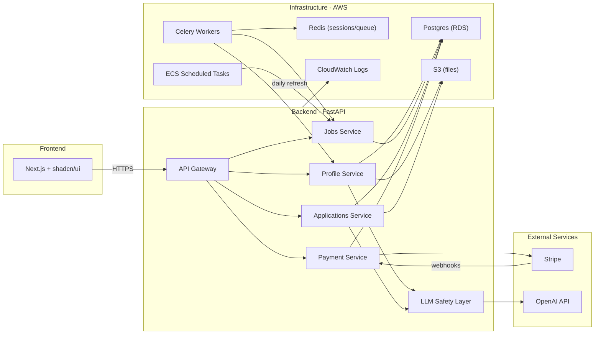

# Job Finder MVP Architecture Plan

## Goals

- Translate the PRD into a concrete architecture and implementation approach.
- Define minimal data model, APIs, and services needed for the MVP flow.
- Keep scope aligned with constraints: no auto-apply, no scraping, no mandatory signup.

## Context from Auto-Apply Systems (Deferred)

- Full auto-apply pipelines typically include ingestion from scraped job boards, embeddings-based matching, per-job document generation, and browser automation (Playwright/Puppeteer) with tracking feedback loops.
- These capabilities are explicitly deferred in the MVP due to constraints: no scraping, no browser automation, and no auto-submit.
- We will structure interfaces so future automation can be added later without reworking MVP data models.

## Assumptions

- Repository is empty, so this plan will outline structure, not code changes.
- Styling will use Tailwind CSS per user rule.

## User Types

### MVP
- **Job Seekers (type: U)**: Upload resume, view matches, complete assisted applications. Default type.

### Post-MVP
- **Recruiters (type: R)**: Search for candidates, view profiles (later: post jobs).
- **Employers (type: E)**: Company accounts, post jobs, manage applications (later).

Data model should include a `user_type` field from the start to support future expansion.

## Monetization (MVP)

### Pricing Tiers

| Feature | Free | Pro |
|---------|------|-----|
| Job selections | 5/day | Unlimited |
| View match scores + reasons | Yes | Yes |
| Cover letter generation | No | Yes (unlimited) |
| Saved application history | No | Yes |
| Account persistence | No (24hr session) | Yes |
| **Price** | $0 | **$15/month** OR **$29 one-time (30 days)** |

### Payment Provider
- **Stripe** for subscriptions and one-time payments
- Stripe Checkout for payment flow (hosted, PCI-compliant)
- Webhooks for subscription lifecycle (created, renewed, cancelled)

### Cost Structure
- **OpenAI API**: ~$0.01-0.05 per cover letter (GPT-4/5)
- **AWS**: Minimal at MVP scale (~$50-100/month)
- **Margin**: At $15/mo with ~10 cover letters/user = ~$0.50 LLM cost = healthy margin

### Free Tier Limits
- Tracked per session (unauthenticated) or per user (authenticated)
- Daily reset at midnight UTC
- Redis counter: `selections:{session_id}:{date}` with TTL

## Tech Stack (Finalized)

### Frontend
- **Next.js** (App Router)
- **shadcn/ui** component library
- **Tailwind CSS** for styling
- **Context API** for state (plan to migrate to Zustand if state grows)
- **Zod** for runtime validation

### Backend
- **Python + FastAPI**
- **OpenAI GPT-5** (abstracted for future multi-model support)
- **LLM safety layer**: prompt templates + Pydantic output validation + resume-truth checks (no hallucinated skills)
- **Pydantic** for request/response schemas

### Payments
- **Stripe** (subscriptions + one-time payments)
- Stripe Checkout (hosted payment page)
- Stripe Webhooks (subscription events)

### Database
- **Postgres + JSONB** (no MongoDB; JSONB handles semi-structured data)

### Storage
- **AWS S3** for all files (resumes, cover letters, generated docs)

### Queue / Workers
- **Celery + Redis** for async tasks (parsing, ingestion, doc generation)

### Scheduler
- **AWS ECS scheduled tasks** for daily job ingestion refresh

### Observability
- **stdout/stderr structured logs + AWS CloudWatch** (keep simple for MVP)

### CI/CD
- **GitHub Actions** (skip Jenkins)

### Infrastructure
- **Docker** containers
- **AWS** (ECS, RDS, S3, CloudWatch)
- **Redis** (sessions, rate limiting, Celery broker)

### Rate Limiting
- FastAPI middleware + Redis

### Auth (Post-MVP)
- Plan for JWT or NextAuth when account conversion is added

## Proposed Architecture (High-Level)

- Frontend (Next.js): landing, resume upload, match list, job selection, assisted apply, and post-action signup prompt.
- Backend API gateway: handles upload, session profile, matching, and apply preparation.
- Services:
  - Resume parsing service (PDF/DOCX extraction + normalization).
  - Job ingestion service (Greenhouse + Lever polling + de-dup + daily refresh).
  - Matching service (deterministic scoring + explainable reasons).
  - Assisted apply service (cover letter generation + download/copy payloads).
  - Payment service (Stripe integration, subscription management).
- Data stores:
  - Postgres + JSONB for jobs, companies, applications, sessions, and accounts.
  - Redis for session caching, rate limiting, and Celery task broker.
  - S3 for all file storage (resumes, cover letters, generated docs).

## Job Discovery (MVP)

### The Challenge
Greenhouse/Lever APIs require knowing company board tokens upfront — no global search.

### Solution: Hybrid Approach
1. **Curated seed list** (~50 companies): Pre-selected tech companies known to be hiring. Polled daily.
2. **User-specified companies** (optional): Users can add target companies they're interested in.
3. **Community expansion**: Grow the list over time based on user submissions.

### Implementation
- Seed list stored in `companies` table with board tokens.
- Users can suggest companies via simple form (stored for review).
- Industry-based suggestions possible later (e.g., "fintech" → Stripe, Plaid).

## Job Ingestion (MVP)

### ATS Sources
Both **Greenhouse** and **Lever** public APIs (no auth required):

| ATS | Endpoint Pattern | Notes |
|-----|------------------|-------|
| Greenhouse | `boards-api.greenhouse.io/v1/boards/{token}/jobs` | Most widely used |
| Lever | `api.lever.co/v0/postings/{company}` | Simpler response format |

### Implementation
- Shared `ATSAdapter` interface with per-ATS implementations (~50-100 lines each).
- Curated seed list: ~25 companies per ATS (50 total) to start.
- Daily refresh via ECS scheduled task.
- Deduplication on `source` + `source_job_id`.

### Data Extracted
- Job ID, title, location, department, description (HTML)
- Apply URL (for manual submission)
- Skills extracted from description via LLM/regex
- Seniority inferred from title

## Architecture Diagram (MVP)



## Data Model Outline

### Sessions (TTL: 24 hours)
- `id`: UUID
- `resume_text`: extracted text
- `resume_s3_key`: S3 path to original file
- `extracted_skills`: JSONB array
- `inferred_titles`: JSONB array
- `seniority`: string (junior/mid/senior/lead/executive)
- `location_pref`: string
- `remote_pref`: boolean
- `years_experience`: integer
- `daily_selections`: integer (reset daily, max 5 for free)
- `created_at`: timestamp
- `expires_at`: timestamp (created_at + 24h)

### Jobs
- `id`: UUID
- `company_id`: FK
- `title`: string
- `location`: string
- `remote`: boolean
- `seniority`: string
- `description`: text
- `skills_extracted`: JSONB array
- `source`: enum (greenhouse, lever)
- `source_job_id`: string
- `apply_url`: string
- `updated_at`: timestamp

### Companies
- `id`: UUID
- `name`: string
- `greenhouse_board_token`: string (nullable)
- `lever_board_token`: string (nullable)
- `user_suggested`: boolean (default: false)

### Matches (computed, cacheable)
- `session_id`: FK
- `job_id`: FK
- `score`: integer (0-100)
- `tier`: enum (strong, medium, weak)
- `reasons`: JSONB (why it matches)
- `missing_skills`: JSONB array

### Applications
- `id`: UUID
- `session_id`: FK (nullable after conversion)
- `user_id`: FK (nullable before conversion)
- `job_id`: FK
- `cover_letter_s3_key`: string (nullable for free tier)
- `cover_letter_tone`: enum (formal, concise, technical)
- `resume_variant_s3_key`: string (nullable, v1.1)
- `status`: enum (prepared, user_submitted)
- `created_at`: timestamp

### Users
- `id`: UUID
- `email`: string
- `user_type`: enum (U, R, E) — default: U (job seeker)
- `plan`: enum (free, pro) — default: free
- `stripe_customer_id`: string (nullable)
- `subscription_status`: enum (none, active, cancelled, past_due)
- `subscription_ends_at`: timestamp (nullable)
- `created_at`: timestamp

### Subscriptions (Stripe sync)
- `id`: UUID
- `user_id`: FK
- `stripe_subscription_id`: string
- `plan_type`: enum (monthly, one_time)
- `status`: enum (active, cancelled, past_due)
- `current_period_start`: timestamp
- `current_period_end`: timestamp
- `created_at`: timestamp

## API Surface (Minimal)

### Core Flow
- `POST /api/resume/upload` → returns session_id + parsed profile
- `GET /api/matches?session_id=...` → ranked jobs with explanation payloads
- `POST /api/jobs/select` → store selections (enforces 5/day limit for free)
- `POST /api/apply/prepare` → cover letter (Pro only) + download/copy payloads
- `POST /api/signup` → convert session to user

### Payments
- `POST /api/checkout/create` → returns Stripe Checkout session URL
- `POST /api/webhooks/stripe` → handle Stripe events (subscription created, cancelled, etc.)
- `GET /api/subscription/status` → returns current plan + limits

## Matching Heuristics (Explainable)

### Scoring Components
- **Skill overlap** (40%): matched skills / total job skills
- **Title similarity** (30%): token overlap + seniority keyword match
- **Seniority fit** (20%): exact match = full points, ±1 level = partial
- **Location fit** (10%): remote match or location match

### Tier Thresholds
- **Strong**: score >= 90
- **Medium**: score >= 60
- **Weak**: score < 60

### Explainability
Each match includes:
- `reasons`: ["5/6 required skills match", "Title aligns with Senior Engineer"]
- `missing_skills`: ["Kubernetes", "GraphQL"]

## Assisted Apply UX Flow

### Free Tier
- Select up to 5 jobs/day
- View match reasons
- Open apply link (no cover letter)

### Pro Tier
- Unlimited job selections
- For each selected job, user picks **cover letter tone**: formal / concise / technical
- Generate tailored cover letter via LLM (resume-truth enforced)
- Provide:
  - Copy-to-clipboard
  - Download as PDF/DOCX
  - Open employer application page (user manually submits)

## Compliance & Trust

- Always surface "We assist — you submit" messaging.
- No credential storage; only session-based info until signup.
- Explicit consent action per apply.

## Risks & Quality Gates (MVP-appropriate)

- Irrelevant matches → keep filters strict and make reasons visible.
- Hallucinated skills → enforce resume-truth checks during generation.
- Duplicate applications → dedupe on job source IDs and company+title+location.
- User control → allow opt-in selection only (no background apply).
- Payment fraud → use Stripe's built-in fraud protection.

## Suggested Repo Structure

```
jb-finder-app/
├── frontend/                # Next.js + shadcn/ui + Tailwind
│   ├── app/
│   ├── components/
│   ├── lib/
│   └── package.json
├── backend/                 # Python + FastAPI
│   ├── app/
│   │   ├── api/             # Route handlers
│   │   ├── services/        # Business logic (profile, jobs, applications, payments)
│   │   ├── ingestion/       # ATS adapters (Greenhouse, Lever)
│   │   ├── llm/             # LLM safety layer + prompt templates
│   │   ├── workers/         # Celery tasks
│   │   └── models/          # Pydantic schemas + DB models
│   ├── requirements.txt
│   └── Dockerfile
├── infra/                   # AWS CDK or Terraform (later)
├── docker-compose.yml       # Local dev (Postgres, Redis, etc.)
└── .github/workflows/       # GitHub Actions CI/CD
```

## Next Steps (If/When You Want Code)

- Scaffold Next.js + Tailwind + shadcn/ui frontend.
- Scaffold FastAPI backend with Pydantic models.
- Set up docker-compose for local Postgres + Redis.
- Implement upload → parse → session flow.
- Build ATS adapters for Greenhouse and Lever.
- Add deterministic matching and explanation generation.
- Add LLM safety layer with prompt templates.
- Integrate Stripe for payments (Checkout + Webhooks).
- Implement free tier limits (5 selections/day, no cover letter).
- Curate initial seed list of ~50 companies (25 Greenhouse, 25 Lever).
